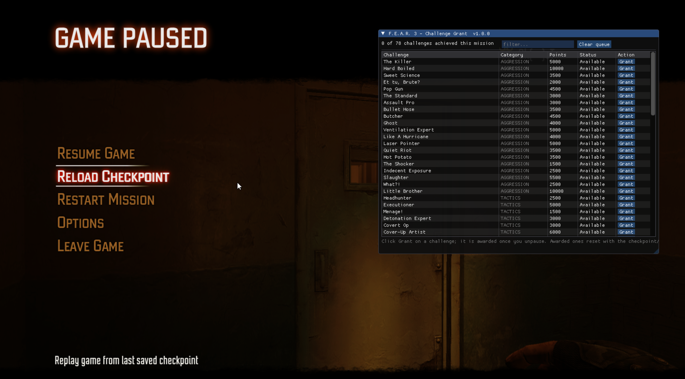

# Fear3ChallengeGrant

Grant any campaign challenge from the pause menu of **F.E.A.R. 3** (Steam, PC).

Pause the game during a mission and a panel lists every challenge the game knows about — *Sweet
Science*, *Hard Boiled*, *Mommy!*, all of them — with its category, point value and whether it has
already been achieved in the current mission. Click **Grant** on any that is still available. The
moment you unpause, the game awards it through its own scoring code: the same pop-up, the same
score, the same mission and lifetime statistics as earning it for real.

- A challenge can only be granted once per mission, exactly as in vanilla. The game tracks that; the
  panel shows those rows as *Awarded* and locks them until you reload a checkpoint or start a level.
- A queued click can be cancelled until you unpause. Reloading a checkpoint or leaving the level
  discards the queue.
- Nothing is written to your saves by the mod itself; the game does what it always does.



Works on Windows and on Linux/Proton with no launch options. Direct3D 11 (the default) and Direct3D 9
(`-d3d9` in `options.cfg`) are both supported.

## Install

1. Open your F.E.A.R. 3 folder (the one containing `F.E.A.R. 3.exe`).
2. Rename the existing `binkw32.dll` to `binkw32_orig.dll`.
3. Copy the mod's `binkw32.dll` in beside it.

Steam's *Verify integrity of game files* puts the stock DLL back; just repeat step 3 if that happens.
To uninstall, delete the mod's `binkw32.dll` and rename `binkw32_orig.dll` back.

## Use

Press **Esc** during a mission. The panel appears next to the game's pause menu; the game's own
buttons keep working beside it. **F8** hides/shows the panel while paused. Type in the filter box to
narrow the list by name or category. Hover a row for the challenge's requirement text (the game's
own wording), its points and category. Click a header to sort by that column (again for descending, a
third time for the game's own order). Column edges can be dragged to resize, headers dragged to
reorder, and right-clicking a header hides or shows columns; the panel's position, size and column
layout are remembered in `Fear3ChallengeGrant.imgui.ini` next to the DLL.

`Fear3ChallengeGrant.ini` is created next to the DLL on first run:

| Key | Default | Meaning |
| --- | --- | --- |
| `ToggleKey` | `0x77` (F8) | virtual-key code that hides/shows the panel while paused |
| `PlayerIndex` | `0` | local player slot that receives the grants (0 in single player) |
| `GrantDelayMs` | `500` | delay after unpausing before the queued challenges are granted |
| `AlwaysShow` | `0` | debug: draw the panel even outside the pause menu |
| `Trace` | `0` | verbose diagnostics in `Fear3ChallengeGrant.log` |
| `Disable` | | comma list of subsystems to turn off: `overlay,dispatch,game` |

`Fear3ChallengeGrant.log` beside the DLL records what the mod found and did; attach it when reporting
a problem.

## How it works

The mod ships as a proxy `binkw32.dll` (the game's Bink video DLL, forwarded untouched), so it loads
before the game starts and needs no injector. It locates the engine's own script-facing functions —
`AwardChallengeRequirement`, `HasPlayerAchievedChallenge`, `IsPauseMenuShowing`,
`HasPlayerStartedLevel` — by scanning for their registration code at runtime (no fixed addresses;
the Steam-protected executable is never modified), verifies every object it touches through the
game's RTTI, and reads the challenge table and localised names from the game's own data. The panel is
Dear ImGui drawn from a hook on the swap chain's `Present`. See `CLAUDE.md` for the full
reverse-engineering record.

## Building from source

Linux with mingw-w64 (`i686-w64-mingw32-g++`); no Windows or MSVC needed.

```sh
cp config.mk.example config.mk   # set GAME_DIR
make                             # build/binkw32.dll
make install                     # deploy into GAME_DIR (renames the stock DLL once)
make rev 1.1.0                   # set the version (VERSION file, baked into the DLL)
make package                     # dist/Fear3ChallengeGrant_v<version>.zip
```

Dear ImGui (MIT) is vendored under `contrib/imgui`. Licensed under the GPL-3.0; see `LICENSE`.
